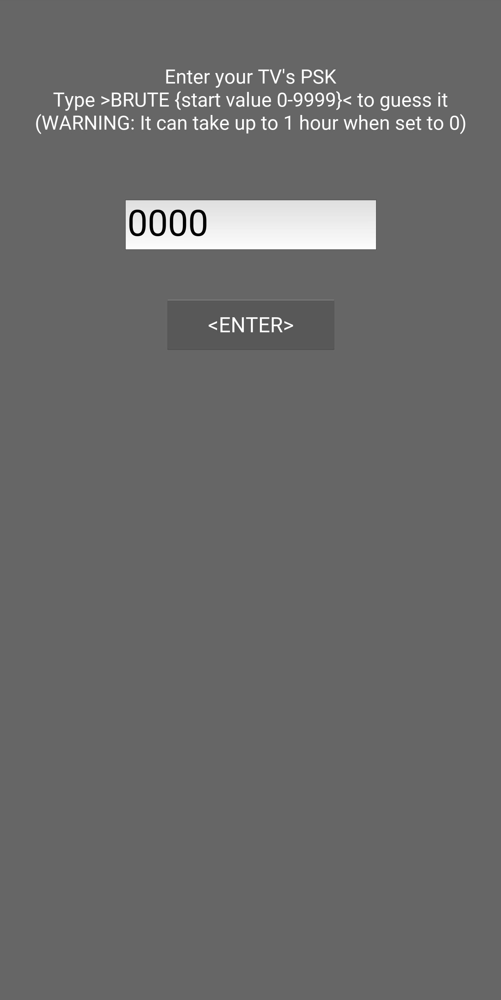
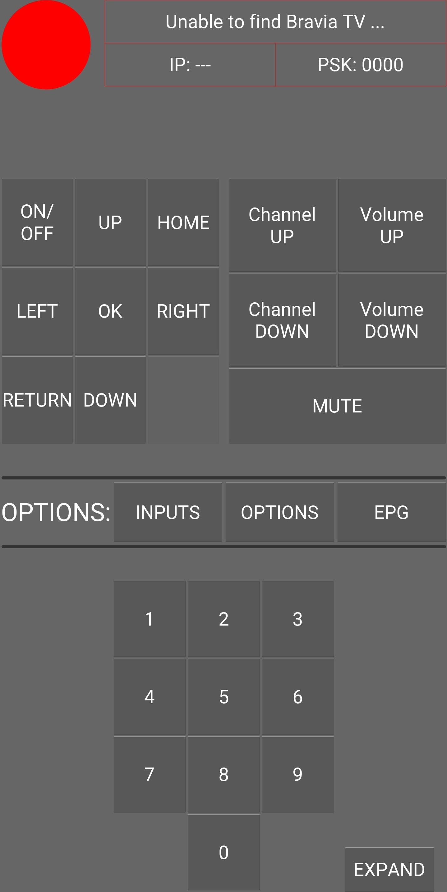
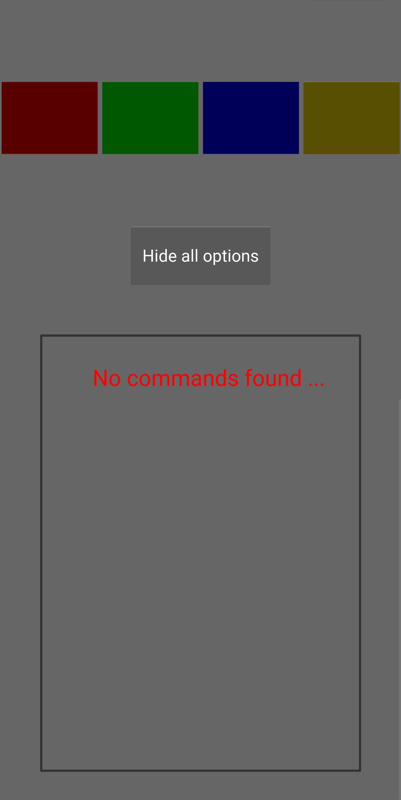
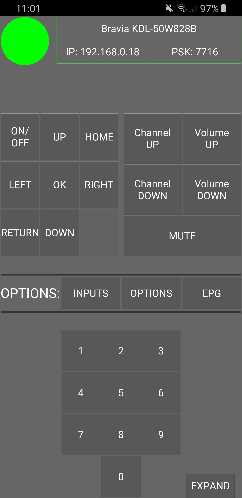
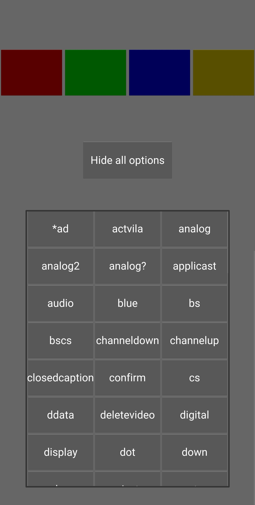
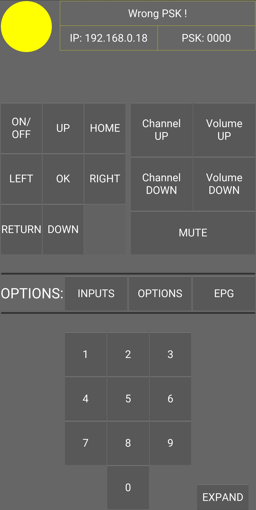

# TV-Remote-for-Sony-Bravia-on-Android
An application that allows you to control remotely Sony Bravia TV.
# Usage
* If you want to preview the application on your PC simply run Control.py file with your IDE (make sure that the rest of the files are in the same directory | This application may look improperly (too big/small font/textures) on PC because it was made for smartphones).
* If you want to install the application on your smartphone you need to download and run included BraviaTV.apk file.
# App appearance
After installation on your smartphone the application should look like this:
  

  
When you connect to wifi with Sony Bravia TV on it, app should look like this:
  

  
When Sony Bravia TV is on the network but you provide wrong PSK, app should look like this:
  
  
If you don't know your TV's PSK you can try to guess it by typing BRUTE {start value 0-9999}:  

